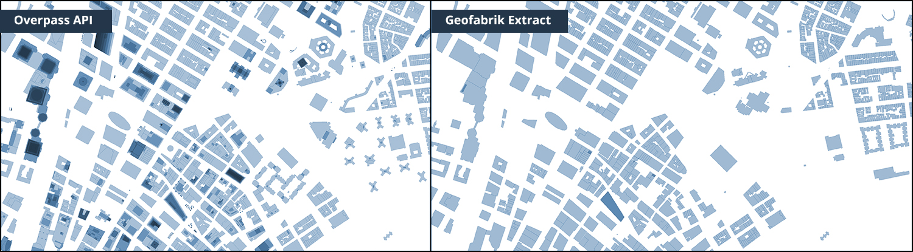

# Open Street Maps Extracts
Method to extract layers and features from Open Street Maps to a local system.

Open Street Maps provides extracts that can be downloaded from various portals. This repository explains the steps for OSM Extracts procured from [Geofabrik Download Service](http://download.geofabrik.de/).

[Reference: Planet Extracts](http://wiki.openstreetmap.org/wiki/Planet.osm)

Alternatively, you may also download OSM extracts using Overpass API. See documentation [here](https://github.com/UrbanSystemsLab/OverpassAPI-OSM-Extracts)


## Steps
- Download OSM Extract as `.osm.pbf` file
- Extract required OSM data from PBF
- Convert OSM file to GeoJSON format
- Store GeoJSON data in a MongoDB database for futher processing
- Export the required dataset from MongoDB
- Convert the exported data to GeoJSON and SHP File

### 1. OSM Data Extracts
OSM Data Extracts are available through [Geofabrik Download Service](http://download.geofabrik.de/)
PBF Format ("Protocolbuffer Binary Format") 

### 2. Convert PBF to OSM Format
Use [OSM convert](https://wiki.openstreetmap.org/wiki/Osmconvert) to extract the OSM data from PBF file. Bounding box parameter can also be used to clip the output extract within the specified region.

```sh
# Simple Conversion
osmconvert pbf-file.osm.pbf > osm-file.osm

# Clip the output to a bounding box (Provide the lat/long parameters)
osmconvert pbf-file.osm.pbf -b="min Longitude , min Latitude , max Longitude , max Latitude" -o="osm-file.osm"
```

### 3. Convert OSM to GeoJson Format
User [OGR2OGR](http://www.gdal.org/ogr2ogr.html) commandline utility to convert OSM to GeoJSON format. Use the provided config file to translate all tags from OSM to GeoJSON. [Reference](http://wiki.openstreetmap.org/wiki/OGR).

[.ini Source ](https://raw.githubusercontent.com/BerryDaniel/georemedy-osm-arcgis/master/configuration/osmconf.ini)

It is also helpful to first convert the OSM data to SHP File for investigating the various layers in a GIS software of your choice.

```sh
# Extract multipolygons only as GeoJSON
ogr2ogr -f "GeoJSON" --config OSM_CONFIG_FILE osmconf.ini geojson-file.geojson osm-file.osm -skipfailures -overwrite multipolygons 

# Convert to SHP file
ogr2ogr -f "ESRI Shapefile" --config OSM_CONFIG_FILE osmconf.ini destination-folder osm-file.osm -skipfailures -overwrite -lco ENCODING=UTF-8
```

### 4. Store to MongoDB
Use [jq](https://stedolan.github.io/jq/) commandline stream editor (sed) to extract features from GeoJSON into a JSON file

```sh
jq  ".features" --compact-output geojson-file.geojson > features.json
mongoimport --db databaseName -c features --file "features.json" --jsonArray
```

### 5. Aggregate buildings in MongoDB
Run the mongo shell using `mongod`. In another shell run `mongo` command to perform the following to inspect and aggregate the necessary data.

Aggregate buildings from `features` collection into `buildings` collection. *Optionally*, add some arbitrary height to buildings that are missing the `properties.height` attribute.

```sh
# Count features with properties = Buildings:True OR Height:True
db.features.find({ $or : [{'properties.building' : {$exists : true} },{'properties.height' : {$exists : true} }]}).count()

# Aggregate those features to buildings collection
db.features.aggregate([{ $match: {$or : [{'properties.building' : {$exists : true} },{'properties.height' : {$exists : true} }]} },{ $out: "buildings" }])

# Count buildings that are missing height attribute
db.buildings.count({'properties.height': {$exists : false}})

# Set default height for those buildings to '3'
db.buildings.find({'properties.height': {$exists : false}}).forEach(function(obj) {db.buildings.update({_id : obj._id},{$set : {'properties.height' : parseFloat('3')}});});

```

⚠️ **Note**: Some third-party apps and libraries expect strict data type usage. For example, Mapbox-gl-js library expects height (for 3D-building-extrusion) as number instead of string. Use the following steps to convert the field in MongoDB to correct data type

```sh
# Count the features that have height encoded as string
db.buildings.find({'properties.height' : {$type : 2} }).count()

# Convert string data type to float 
db.buildings.find({'properties.height': {$exists : 'true'}}).forEach(function(obj) { 
	db.buildings.update({_id : obj._id},
	{
		$set : {'properties.height' : parseFloat(obj.properties.height)}
	});
});

```


### 6. Export Buildings
Export the collection that contains the needed data out to a JSON Array

```sh
mongoexport --db databaseName -c buildings --out "building_export.json" --jsonArray 

```

### 7. Convert to JSON to GeoJSON
```sh
# Input: json-file.json 
# Output: geojson-file.geojson

echo '{ "type": "FeatureCollection","features":'  >> geojson-file.geojson ; cat  building_export.json >> geojson-file.geojson ; echo '}' >> geojson-file.geojson
```

### 8. Convert to GeoJSON to SHP File

```sh
ogr2ogr -f "ESRI Shapefile" data.shp "geojson-file.geojson" -skipfailures
```

---

#### ⚠️ UTF-8 Encoding Warning

 Make sure that the console output and resultant file output is utf-8. Otherwise JQ may not work as expected.

**Windows Powershell Users**: Set output encoding to utf-8 [Reference](https://stackoverflow.com/questions/40098771/changing-powershells-default-output-encoding-to-utf-8)

```sh
# You can set out-file encoding to utf8 
$PSDefaultParameterValues['Out-File:Encoding'] = 'utf8'

# OR to convert a text file to utf8
Get-Content UTF-16LE_encoded.geojson | Set-Content -Encoding utf8 utf8_encoded.geojson
```